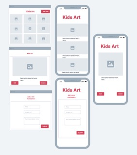

# Kids Art App 

The Kids Art App is a React frontend application where the user can store an image and description of their childs artwork to display to friends and family.

### [Link to Kids Art App](kids-art-app-frontend.netlify.app)

### Technologies Used

- React
- react-router-dom
- django
- CSS
- imageKit.io

### Component Architecture

### Frontend Route Table

| Route    | Element    | Loader |Action| Description|
| :---    | :----: | :----:    | :----   |:----   |
|/        |Index  | indexLoader|         |Display a list of art|
|/art/:id |Show   | artLoader  |          |Display a specific piece of art|
|/create  |Create |         | artCreateAction|Handles submission of create form for art|
|/update/:id  |Update |      |artUpdateAction|Handles submission of update form for art|
|/delete/:id |Delete |       |artDeleteAction|Handles submission of delete form for art|

### Mockups

### Trello Workspace
[Trello Board](https://trello.com/b/ORFSAKW2/kids-art-app-project)